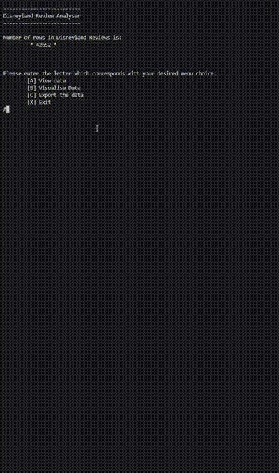

<h1 align="center">Problem Solving Assignment - Year One
Solent University
</h1>
 
<h2 align="center">
Project Overview
</h2>
 

This assignment involves the development of a Python program utilizing CSV file handling, data visualization with Matplotlib, and Object-Oriented Programming (OOP) principles. The goal is to create a robust solution adhering to the latest Python standards.

